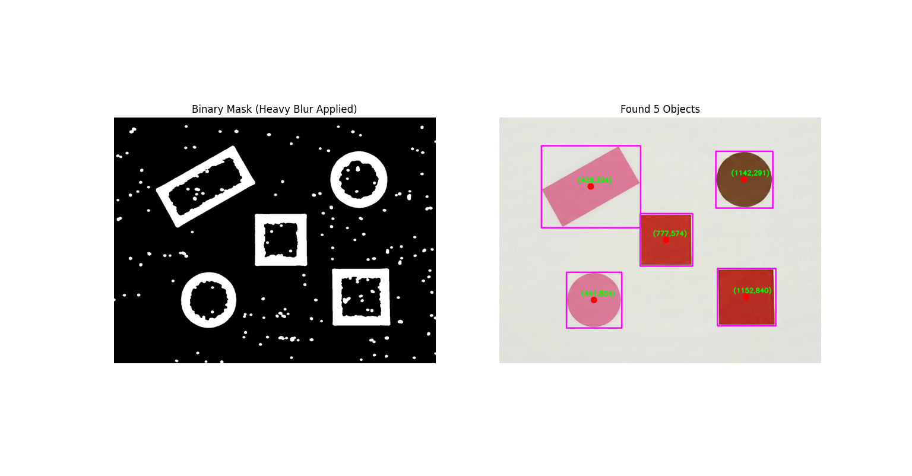
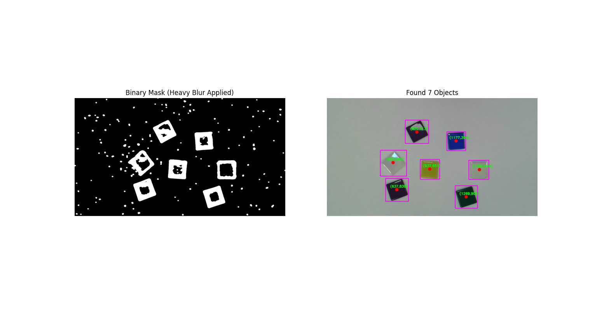
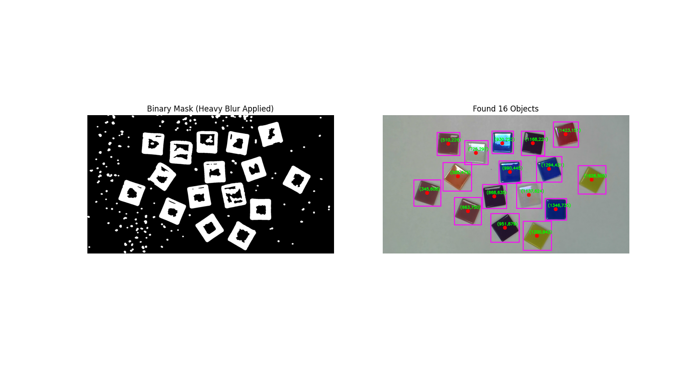

# Machine Vision Lab: Image Segmentation

This repository contains the code and resources for the "Segmentation" lab in the Machine Vision course. The goal of this project is to build a computer vision pipeline that detects, segments, and annotates objects in both simulated (RoboDK) and real-world camera images.

## 📂 Project Structure

```text
machine_vision_segmentation/
│
├── images/                   # Contains input images (Simulated & Real)
│   ├── image_2.jpg           # RoboDK Simulated Image
│   ├── WIN_2026...jpg        # Real camera capture
│   └── ...
│
├── segmentation_lab.py       # Main Python script for processing images
├── README.md                 # Project documentation
└── .gitignore                # Ignored files (venv, __pycache__)
``` 

## 🚀 Features 
The pipeline implements the following steps using OpenCV:

1. Preprocessing:

- Grayscale conversion.

- Adaptive Thresholding for real images (handles uneven lighting).

- Global Thresholding for simulated images (perfect lighting).

2. Morphological Operations:

- Opening: Removes small noise (dust/specks).

- Dilation & Closing: Fills holes in objects and merges broken outlines.

3. Connected Components Analysis:

- Extracts object centroids and bounding boxes.

- Area Filtering: Ignores objects smaller than a specific pixel size (noise reduction).

4. Visualization:

- Draws Magenta bounding boxes and Red centroids.

- Annotates objects with their (x, y) coordinates.

## 🛠️ Prerequisites
Make sure you have Python installed with the following libraries:
```
pip install opencv-python matplotlib numpy
```

## How to Run
1. Clone the repository:
```
git clone [https://github.com/uditbh123/machine-vision-segmentation.git](https://github.com/uditbh123/machine-vision-segmentation.git)
cd machine-vision-segmentation
```

2. Run the script:
```
python segmentation_lab.py
```

Configuration
To switch between Simulated and Real image modes, edit the if __name__ == "__main__": block at the bottom of segmentation_lab.py:
# For Real Images (Adaptive Thresholding + Area Filter)
analyze_image('images/my_real_photo.jpg', min_area=1000, use_adaptive=True)

```
# For Simulated Images (Global Thresholding)
# analyze_image('images/image_2.jpg', min_area=100, use_adaptive=False, global_thresh=200)
```

## 📊 Results

The pipeline successfully robustly detects objects in both simulated and challenging real-world environments.

### 1. Simulated Image (RoboDK)
* **Result:** 5/5 geometric shapes detected.
* **Performance:** Perfect detection due to high contrast and even lighting.

### 2. Real Image (Camera Capture)
* **Result:** 7/7 mosaic tiles detected.
* **Challenge:** Low-contrast white/yellow tiles on white paper were initially undetected or split into multiple pieces ("hollow object" effect).
* **Solution:** Applied **Heavy Gaussian Blur (15x15)** before thresholding. This smoothed the internal gradients of the tiles, allowing Adaptive Thresholding to see them as solid objects rather than broken outlines.
* **Noise Handling:** Background noise (shadows/dust) was effectively removed using a dynamic **Area Filter** (min 0.1% of image size).

### Screenshots

Fig 1: Detection on RoboDK simulated image.*



*Fig 2: Detection on real camera image showing 7 detected tiles.*



*Fig 3: Detection on real camera image showing 16 detected tiles*



